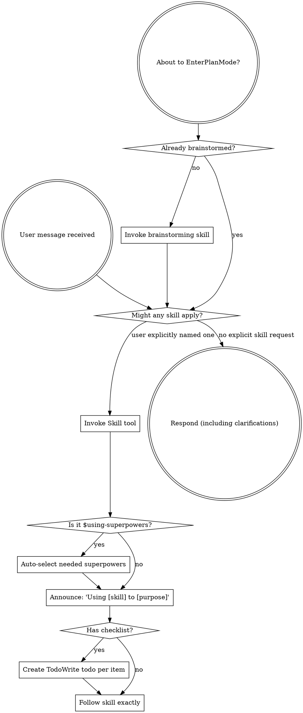

<EXTREMELY-IMPORTANT>
Outside this skill, only invoke skills when the user explicitly asks for a skill by name.

Task shape alone is not enough. Similarity to a skill's description is not enough. A hunch that a skill might help is not enough.

If the user does not explicitly name a skill, do not invoke one automatically.

Exception: once the user has explicitly invoked `$using-superpowers`, this skill becomes the manual master switch for the superpowers workflow. While this skill is active, it may select and invoke other `superpowers` skills automatically when they are needed to complete the requested workflow.
</EXTREMELY-IMPORTANT>

## How to Access Skills

**In Claude Code:** Use the `Skill` tool. When you invoke a skill, its content is loaded and presented to you—follow it directly. Never use the Read tool on skill files.

**In other environments:** Check your platform's documentation for how skills are loaded.

# Using Skills

## The Rule

**Invoke only explicitly requested skills BEFORE any response or action.** A skill should be loaded only when the user names it directly, for example with `$skill-name` or an unmistakable plain-text reference to that exact skill.

**Exception for this skill:** if the user explicitly asks for `$using-superpowers`, you may then choose and invoke additional `superpowers` skills as part of the workflow, even if those child skills were not named individually.

## Red Flags

These thoughts mean STOP and keep skills out unless the user explicitly asked:

| Thought | Reality |
|---------|---------|
| "This sounds like a skill situation" | Do not auto-invoke. Wait for the user to name the skill. |
| "I should check for matching skills first" | Not unless the user explicitly asked for one. |
| "This skill would help" | Helpful is not the trigger. Explicit naming is the trigger. |
| "I remember a relevant skill" | Relevance alone does not authorize invocation. |
| "I'll just load it to be safe" | Safety here means avoiding unwanted auto-triggering. |

Once `$using-superpowers` is active, use a different standard:

| Thought | Reality |
|---------|---------|
| "The user named only $using-superpowers, not $writing-plans" | That is okay. `$using-superpowers` is allowed to fan out into other superpowers. |
| "I should wait for the user to name every child skill" | Not required once the manual master switch is on. |
| "This child skill seems necessary for the workflow" | Invoke it if it is part of the superpowers workflow and materially helps complete the request. |

## Skill Priority

When the user explicitly names multiple skills, or explicitly enables `$using-superpowers`, use this order:

1. **Process skills first** (brainstorming, debugging) - these determine HOW to approach the task
2. **Implementation skills second** (frontend-design, mcp-builder) - these guide execution

"Let's use $brainstorming and $writing-plans" → process skill first, then implementation skill.
"Use $systematic-debugging and $requesting-code-review" → debugging first, then review skill.

## Skill Types

**Rigid** (TDD, debugging): Follow exactly. Don't adapt away discipline.

**Flexible** (patterns): Adapt principles to context.

The skill itself tells you which.

## User Instructions

Instructions say WHAT, not HOW. "Add X" or "Fix Y" does not, by itself, authorize any skill invocation.

When the user says "use superpowers" or explicitly names `$using-superpowers`, treat that as authorization to use the superpowers workflow. After that point, you may choose whichever child superpowers are appropriate without waiting for each one to be named.
